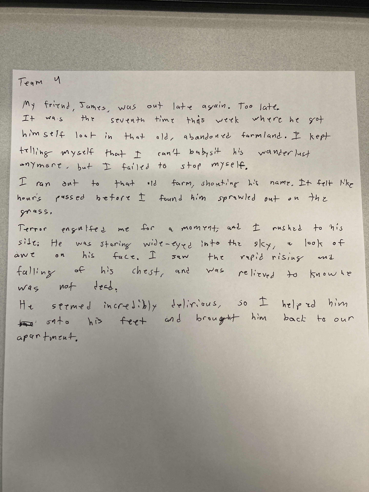

# Transmedia Exercise

- [Instructions are here](../weekly/4A.md#ii-in-class-exercise---transmedia-round-robintelephone-game)

---
---

## The Ghost Ship (team 1)
- *A ship long lost at sea suddenly reappears in a busy harbor, with no crew aboard. You are part of the team sent to investigate. What happened to the crew?*

###  A. Ghost Ship: 100-word story based on the prompt

###  B. Ghost Ship: 3-panel comic strip

###  C. Ghost Ship: "Choose your own adventure"

###  D. Ghost Ship: Final 100-word story 

---
---

## The Deserted Town (team 2)
- *You and your friends decide to visit a town that has been deserted for years. As you explore, you realize the town isn’t as empty as it seems. What do you discover?*

###  A. The Deserted Town: 100-word story based on the prompt

###  B. The Deserted Town: 3-panel comic strip

###  C. The Deserted Town: "Choose your own adventure"

###  D. The Deserted Town: Final 100-word story 

---
---

## A New World (team 3)
*After waking up from a long coma, you find that the world has changed drastically. New technology, new cultures, and new dangers await. How do you adjust to this new life?*

###  A. A New World: 100-word story based on the prompt

###  B. A New World: 3-panel comic strip

###  C. A New World: "Choose your own adventure"

###  D. A New World: Final 100-word story 

---
---

## The Whispering Wind (team 4)
*You hear whispers in the wind that no one else can hear. At first, they seem harmless, but soon they begin to reveal dangerous secrets. What do the whispers want?*

###  A. The Whispering Wind: 100-word story based on the prompt

###  B. The Whispering Wind: 3-panel comic strip

###  C. The Whispering Wind: "Choose your own adventure"

###  D. The Whispering Wind: Final 100-word story 

