# Transmedia Exercise Deliverables

- [Instructions are here](../../weekly/4A.md#ii-in-class-exercise---transmedia-round-robintelephone-game)

---
---

## The Ghost Ship (team 1)
- *A ship long lost at sea suddenly reappears in a busy harbor, with no crew aboard. You are part of the team sent to investigate. What happened to the crew?*

###  A. Ghost Ship: 100-word story based on the prompt
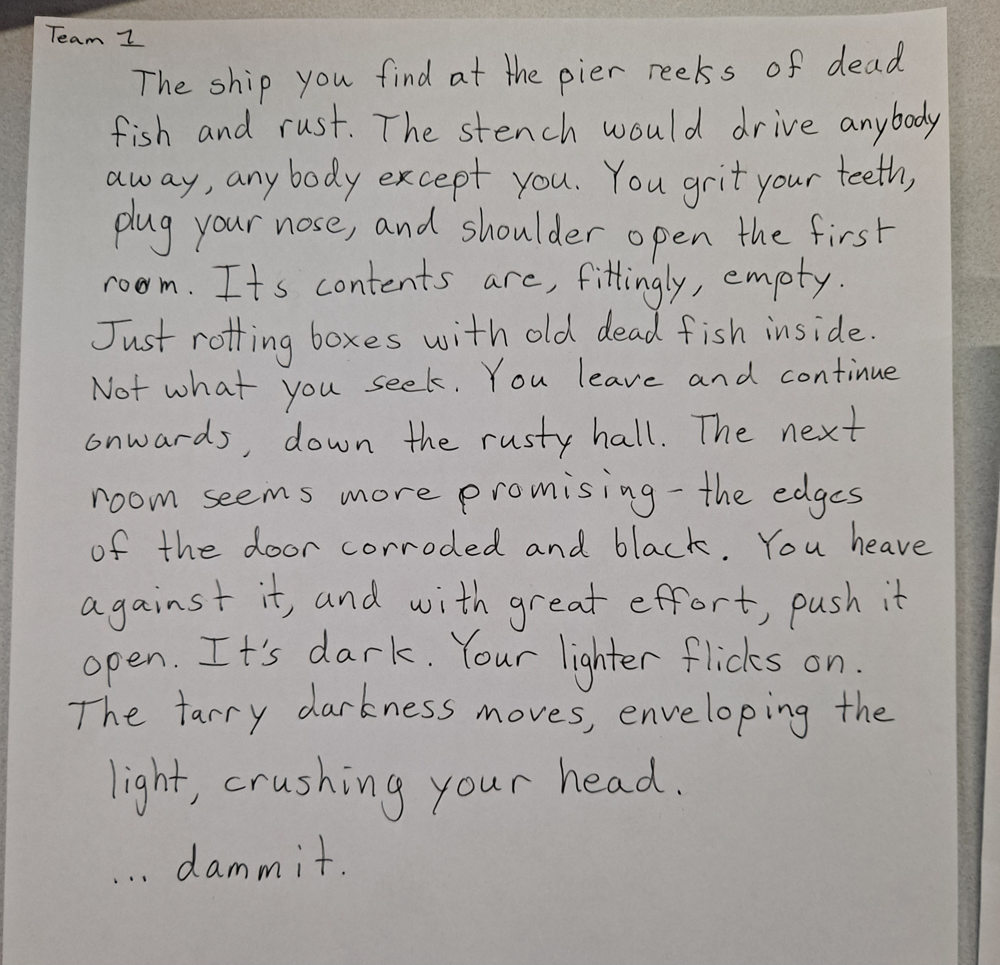

###  B. Ghost Ship: 3-panel comic strip
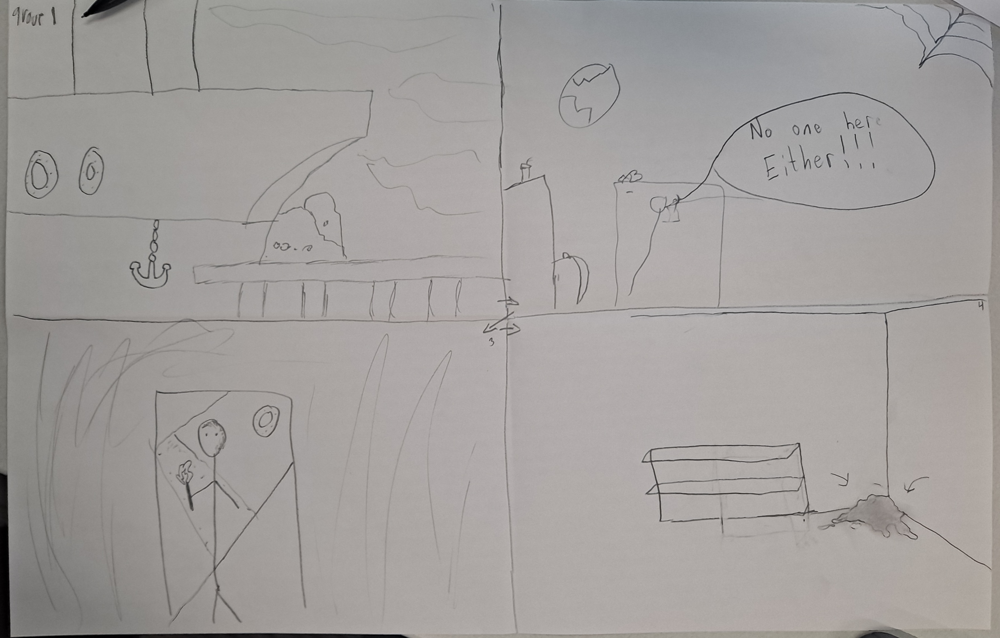

###  C. Ghost Ship: "Choose your own adventure"
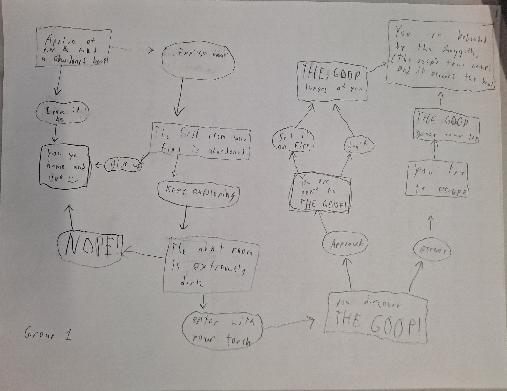

###  D. Ghost Ship: Final 100-word story 
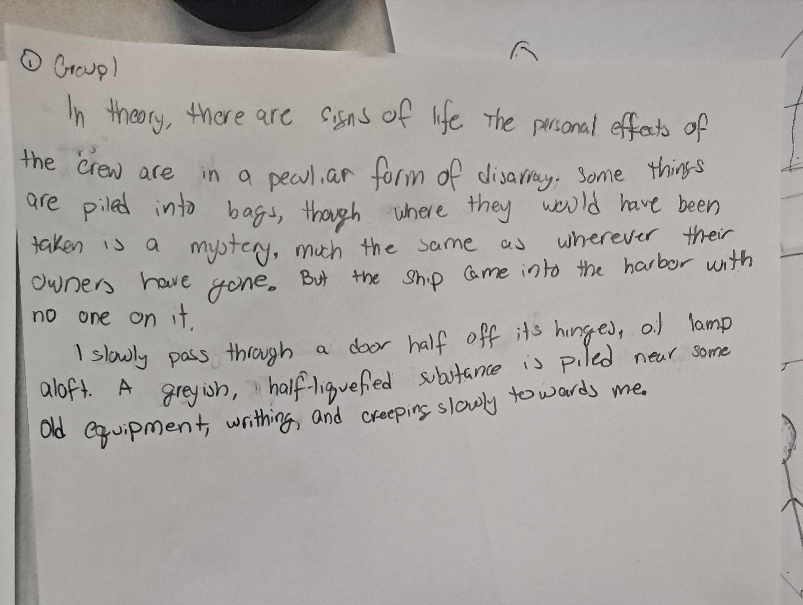

### E. Ghost Ship: Reflection
- The core stayed the same which was surprising, first person, ghost ship, and the goop. the exploration of the ship even followed the same order. of exploring the crew quarters then finding the goop and dying. the most notable diffrences between the final story and the original were:
  - Setting, it went from older wooden ship and oil lamps to modern metal ship with rust.
  - The death of the main character, they did not die in the original but it was alluded to with the goop lunging at them, in the final one it is stated they die
  - Investigating vs exploring, in the original they were employed to investigate the ship, but it wasn't mentioned well so it didn't carry over.
  - Start of the story, the original started already in the ship while the final started outside and went in, which honestly was an improvement

- Our narrative remained almost entirely unchanged by the end of the exercise. Maybe this is
because it’s centered around a pretty identifiable motif, named “THE GOOP” by one of the other
teams, and I suppose the boat is pretty distinct as well. Basically all that changed were some
details of the setting since the original concept was intended to be vaguely medieval, and the
identity of the narrator. But these aspects of the story were only alluded to in the original text, so
I didn’t expect them to have much staying power.

---
---

## The Deserted Town (team 2)
- *You and your friends decide to visit a town that has been deserted for years. As you explore, you realize the town isn’t as empty as it seems. What do you discover?*

###  A. The Deserted Town: 100-word story based on the prompt

###  B. The Deserted Town: 3-panel comic strip
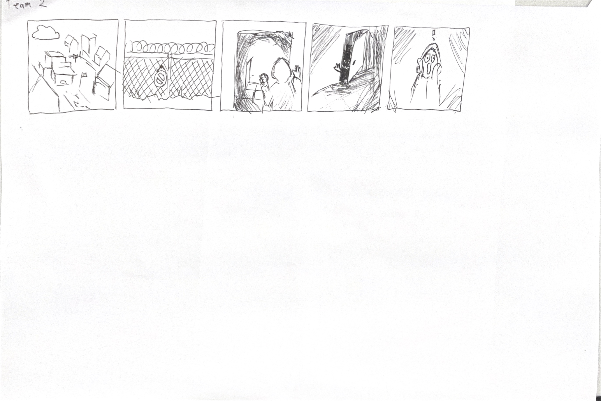

###  C. The Deserted Town: "Choose your own adventure"
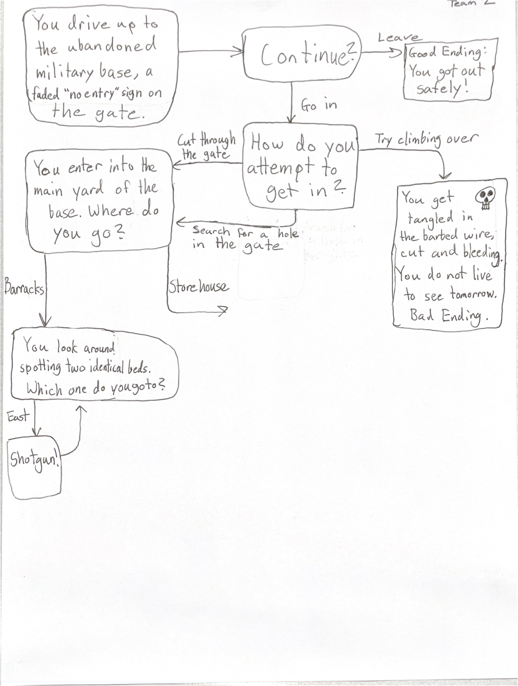

###  D. The Deserted Town: Final 100-word story 
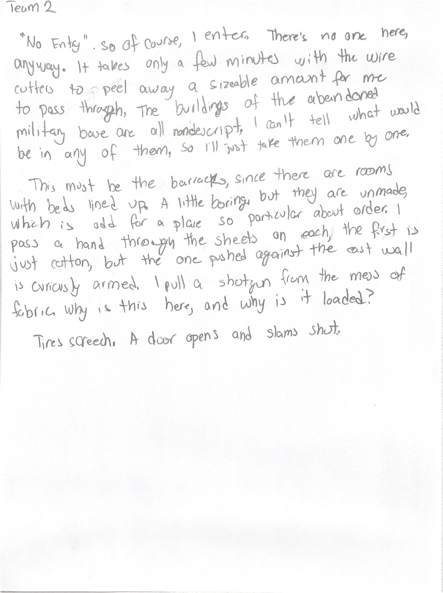

### E. The Deserted Town: Reflection
- The content changed from a group exploring an abandoned town with mythical mystery behind
it, into an abandoned military base explored by a single person.
- With each group’s rendition of our story, the content shifted slightly until it became
almost an entirely different narrative. Small details like how many people there were, the setting,
what kind of creature was discovered, and the tone/emotion evoked all were different from our
original design by the end.
- The core element that remained throughout was the entrance of somewhere that wasn’t
supposed to be, well, entered. Whether it was exploring an abandoned town to a gated off
military base, the character(s) prepared for an adventure, got into the area, and discovered
something otherworldly.
- I would say that the most significant difference was that it went from a group of friends
being curious, to a single person breaking into a government facility. This drastically changes
possible antagonists, the plot, going from mystery to science fiction, and less of a
teen-adventure to more of a horror story.

---
---

## A New World (team 3)
*After waking up from a long coma, you find that the world has changed drastically. New technology, new cultures, and new dangers await. How do you adjust to this new life?*

###  A. A New World: 100-word story based on the prompt
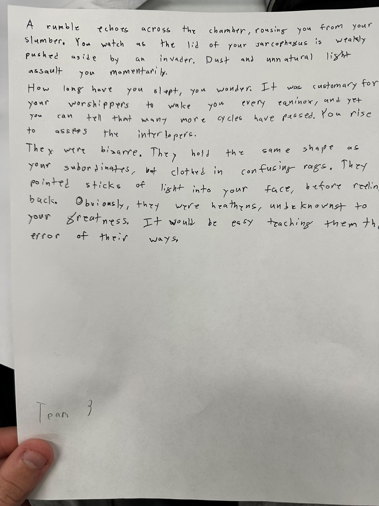

###  B. A New World: 3-panel comic strip
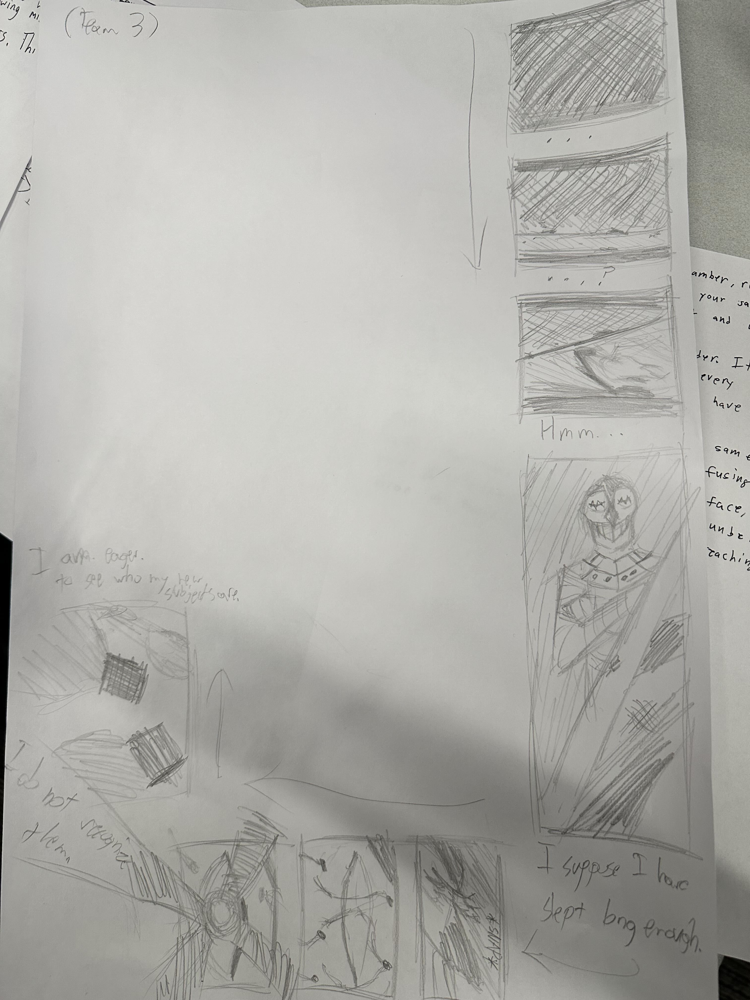

###  C. A New World: "Choose your own adventure"
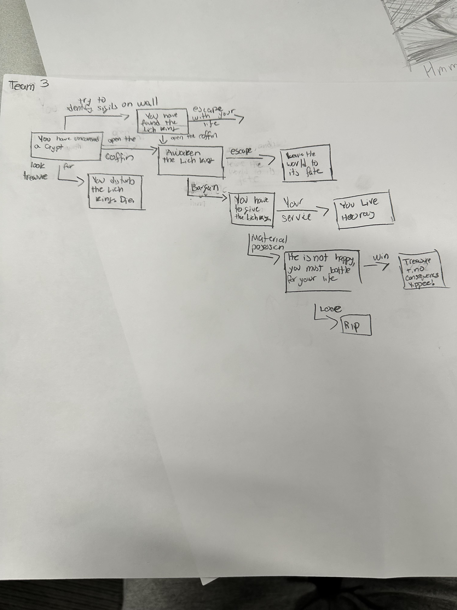

###  D. A New World: Final 100-word story 
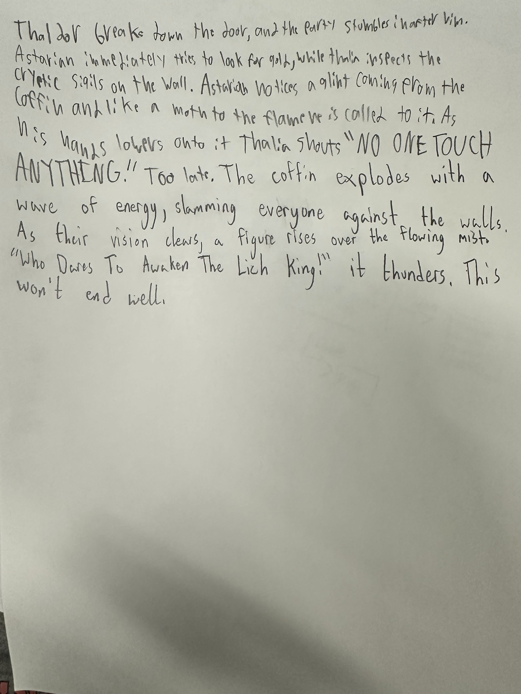

---
---

## The Whispering Wind (team 4)
*You hear whispers in the wind that no one else can hear. At first, they seem harmless, but soon they begin to reveal dangerous secrets. What do the whispers want?*

###  A. The Whispering Wind: 100-word story based on the prompt
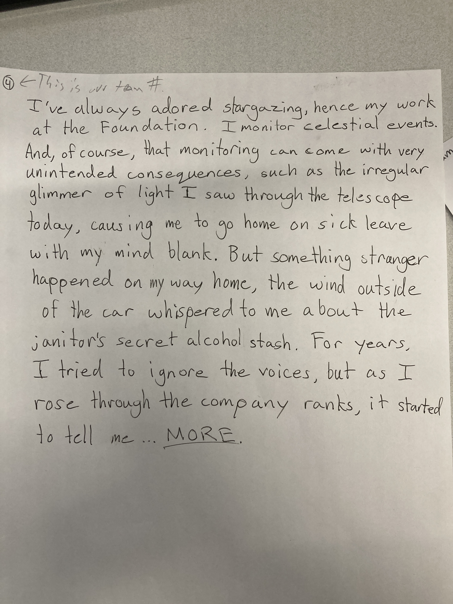

###  B. The Whispering Wind: 3-panel comic strip
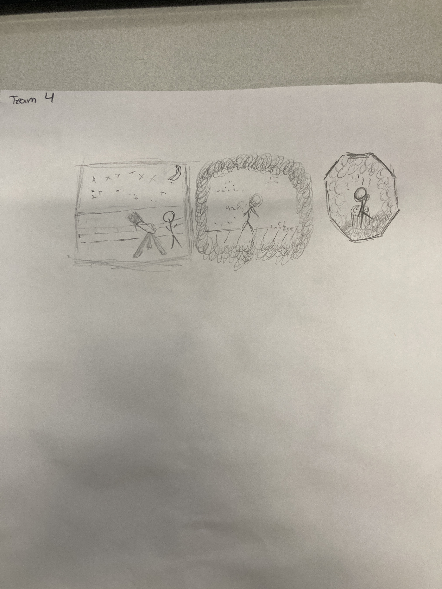

###  C. The Whispering Wind: "Choose your own adventure"
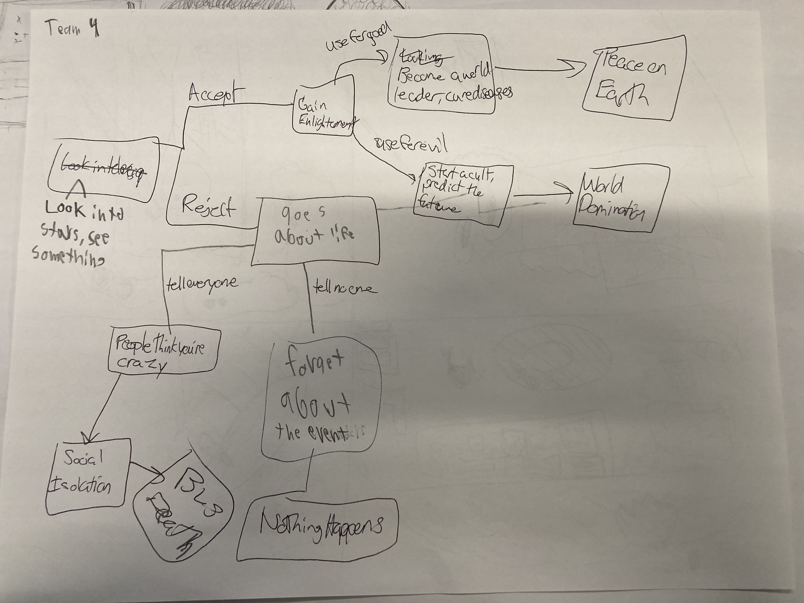

###  D. The Whispering Wind: Final 100-word story 

My friend, James, was out late again. Too late.

It was the seventh time this week where he got himself lost in that old, abandoned
farmland. I kept telling myself that I can’t babysit his wanderlust anymore, but I failed to stop
myself.

I ran out to that old farm, shouting his name. It felt like hours passed before I found him
sprawled out on the grass.

Terror engulfed me for a moment, and I rushed to his side. He was staring wide-eyed into
the sky, a look of awe on his face. I saw the rapid rising and falling of his chest, and was relieved
to know he was not dead.

He seemed incredibly delirious, so I helped him onto his feet and brought him back to our
apartment.

But as the days went by, I noticed drastic changes within him: He spoke of events yet to
come, of how the stars have brought him enlightenment, how the world must be warned. I was
bewildered.

When I tried to convince him to seek therapy, he assaulted me. I was knocked out for a
while. But when I finally woke up, he was gone.

I was worried sick and searched for him day and night, only for my attempts to be
fruitless. I thought that he was dead, or worse, and mourning engulfed the rest of my month.

Until... I saw his face on the news. He began a religion set around his newfound
prophetic “skills”. Looking closer at his manic expression plastered on the television, I saw the
cosmos reflected in his eyes

### E. The Whispering Wind: Reflection
- The greatest difference between the original prompt/story and the end result was, of
course, the focus on the astral aspect.
- The wind was the primary focus of the original prompt,
and the cause for the whispers in the wind being the glimmering star was used to try and flesh
out the storyline better. However, due to the story not being as fleshed out in the written version
as the typed out version online, the wind got sidelined in favor of the star element.
- The visual representation was limited by the three-panel format, and the wind was hard to present through
the visual medium, so the most readily understandable aspect was the stars and the telescope.
- The strangest change was from the CYOA story to the final text, which took place from an
outsiders perspective while the rest were consistent in having the main character be the one
affected by the whispers.
