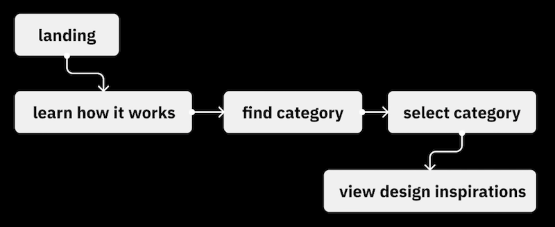

# Week 11A

## I. Project 3: Interactive Digital Prototype
- [Project 3: Interactive Digital Prototype - Putting the team together](../documents/p3-put-team-together.md)
- [Project 3 - Interactive Digital Prototype - deliverable #1 - Work Plan, Features & Personas](../documents/p3-work-plan.md)
- [Project 3 Teams](../documents/p3-teams.md)
  - everyone on a team?
  - all teams have an app idea, list of app features, 3 personas?
- [Project 3 - Interactive Digital Prototype - deliverable #2 - Lo-Fi mockups and in-class testing](../documents/p3-lofi-deliverable.md)
  - due prior to start of class 11A - see myCourses dropbox for exact time

---

## II. User Personas

- Let's take a peak at some of the user personas you came up with for your app prototypes
- BTW - although we went with a "lean" process for personas in this class, without any real research other than the imagination of you and your teammates, personas are commonly much more visual and lean heavily on robust industry marketing research
- IGM students will revisit user personas in *IGME-236 Experience Design for Games & Media*
- To your edification, below is a little more about personas ...

---

### IMPORTANT - What Makes a Professional Persona?

Personas in the UX industry are **visual documents**, not just text. Each persona should include:

**❌ BAD Example (Text Only - Unprofessional):**
> "Sarah, 20, college student. Needs to organize her schedule."

**✅ GOOD Example (Visual Persona Document):**

**Each persona document must include:**

**Visual Elements:**
- A realistic photo (use stock photos from [Unsplash](https://unsplash.com), [Pexels](https://www.pexels.com), or [Generated Photos](https://generated.photos))
- Clean, organized layout (can be created in Canva, Figma, PowerPoint, or Photoshop)

**Required Information:**
- **Name & Basic Demographics:** Age, occupation, location
- **Background/Bio:** Brief description of their life situation and context
- **Goals:** What they want to accomplish (2-4 bullet points)
- **Frustrations/Pain Points:** Current problems they face (2-4 bullet points)
- **Tech Comfort Level:** How comfortable are they with technology?
- **Quote:** In their own words - what would they say about the problem? (1-2 sentences)
- **Scenarios:** When/why/how would they use your app? (brief description)

**Pro Tip:** Look at real persona examples from the resources above to see how professional UX designers present this information visually.

---

⬇️ ⬇️ ⬇️   ***\*\*\*MOVING ON - LET'S DISCUSS EVERYTHING YOU WILL NEED FOR P3 - DELIVERABLE #2\*\*\****  ⬇️ ⬇️ ⬇️ 

---

## III. User Flow 
- This is step #1 from the [UI/UX Design Process Overview](10B.md#iii-uiux-design-process-overview) from last time
- For deliverable #2, you are going to look at each user persona
  - the *primary user*, *power user* and *casual user* ...
  - and think about the most common tasks each user will want to perform with your app (based on that app's features!), in order to meet their goals ...
  - and write them down
- You will then create user flow diagrams for each user - at least five for your *primary user*, and at least two more each for your *power user* and *casual user*
  - that adds up to a minimum of NINE unique user flow diagrams
- Your (simplified, high-level) user flow diagrams need:
  - a *title* that explains the user action (ex. ***"Change shock intensity"***)
  - an *entry point* (ex. ***"App Home Screen"***)
  - a *series of steps* the user will need to take
    - ex. ***"Find Settings Button"*** ➡️ ***"Navigate to Settings Screen"*** ➡️ ***"Change Intensity to Desired Level"***
  - an *end success state* (ex. ***"Confirm Change"***)
 
- For our purposes, a simplified version like this is fine:

---

#### \*\*\* IMPORTANT - USER FLOW DIAGRAMS ARE OFTEN MORE FINE-GRAINED AND DETAILED ... \*\*\*

- and reflect decision points and error states
  - https://www.flowmapp.com/features/user-flow-diagram-examples
  - https://www.uxdesigninstitute.com/blog/design-user-flows-with-examples/

---

## IV. Scenario-Based Usability Testing
- Of the 9 user flow diagrams you created, choose at least 5 tasks that you would like to see your users perform
- Now create app "screens" that map to these "user flows" you chose
- Get inspired! Think about the screens and navigation systems from some popular apps:
  - Apple Music
    - has a *global navigation system* that links to 5 main categories (pages)
      - Home
      - New
      - Radio
      - Library
      - Search
    - this navigation system appears on the same location (the bottom) of every page
    - Searching for on artist from the Search page, and then tapping the artist, gives you an "Artist Detail Page"
    - Choosing a song on this page gives you a "Song Detail Page" that has audio and favoriting controls
  - Google Maps
    - has a *global navigation system* that links to 5 main categories (pages)
      - Explore
      - Go
      - Saved
      - Contribute
      - Updates
    - there is a Search box on the top of both the Explore and Go pages
    - Explore page has filtering controls - "Home", "Restaurant", "Coffee", "Gas" and so on
 
---

## V. BTW - Why Do User Testing?

- [Study Guide 11: User Testing](https://docs.google.com/document/d/1f5h_8OBTGzORzFFOK5QamQqt4XgW4_Xe_ERmpZ9bmU0/edit?usp=sharing)

---

## VI. Testing with paper prototypes (OR low-fidelity digital wireframes)

- Things we can get feedback on:
  - the screen layout - does it make sense to users?
  - content & information architecture
  - interaction designs
  - task flows
  - missing features!
- Prepare for the user test:
  - gather materials for production and iteration
  - use one sheet of paper to wireframe each screen 
  - create an "under construction" page for any time a user clicks on a link or button to something you haven't implemented yet (that's an extra, 6th screen)
  - create a list of tasks for the user to perform
  - assign the 3 roles for the testers:
    - *Facilitator* - interviews/instructs the user, does nearly all of the talking
    - *Computer* - *when the user taps with the finger on a paper “screen” in front of them, the “computer” picks up the page representing the response and places it in front of the user*
    - *Scribe* - writes down responses to questions
- Create the tests:
  - use a version of the provided template --> [P3 - Wireframe Feedback Script](../documents/p3-wireframe-feedback-script.md)
  - customize the tasks and follow-up for your team's app
- Run the tests (we are doing this at our next class meeting 11B):
  - One copy of script per user
  - Between tests, be prepared to update screens or create new screens to fix obvious usability issues or missing features

---

## VII. More testing - Techniques for Discovering Missing Features
- So now you've tested at least 5 user flows - which may or may not hot have gone flawlessly
- But what about all of the things you DIDN'T test?
  - were there things your users want to do while testing these flows that you did not anticipate? For example, filtering results by price or date
  - are there key app features that you did NOT create user flows for? For example, the ability to bookmark and share a search result
- Here are the techniques we'll be using, see the feedback template linked above
  - Scenario-Based Testing
  - The "Think Aloud" Protocol
  - The Post-Task Expectation Interview
  - The Magic Wand Question
 
---

# HOMEWORK! P3 - Deliverable #2
## Due prior to start of class next time - see myCourses dropbox for due date/time

- See --> [P3 - deliverable #2 - Lo-Fi mockups and in-class testing](../documents/p3-lofi-deliverable.md)
- See --> [P3 - Wireframe Feedback Script](../documents/p3-wireframe-feedback-script.md)
- Also refer to the notes on this page, above!
- Next time on 11B, you will test your app in class, using the scripts (i.e. "tasks") you wrote!
- Get with your team, and start working on deliverable #2!
- QUESTIONS?
  - during class, ASK
  - there's paper for prototyping on the back table
  - after class, you can ASK by posting to the ***\*\*\* PROJECT 3 QUESTIONS \*\*\**** thread in your section-specific Slack channel
  - and here's an example --> [P3 Deliverable #2 Example: MealMate Recipe App](https://github.com/jptweb/IGME-110-Fall-2025/blob/main/documents/p3-lofi-example.md)

---
---

| <-- Previous Unit | Home | Next Unit -->
| --- | --- | --- 
|   [**Week 10B Notes**](10B.md)  |  [**IGME-110 Home**](../) | Week 11B Notes
