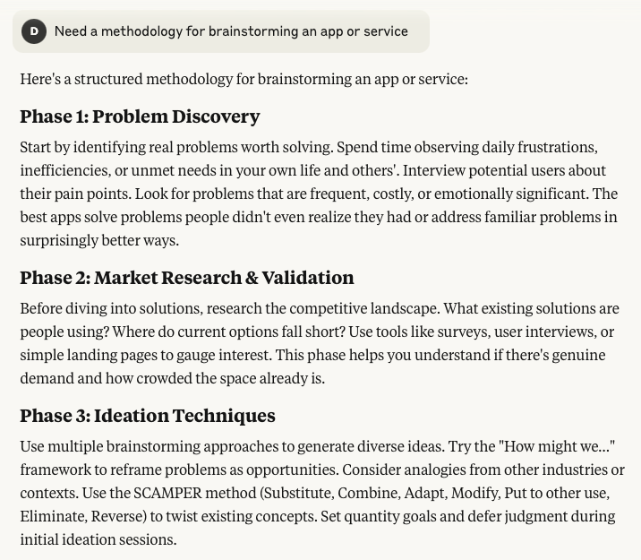
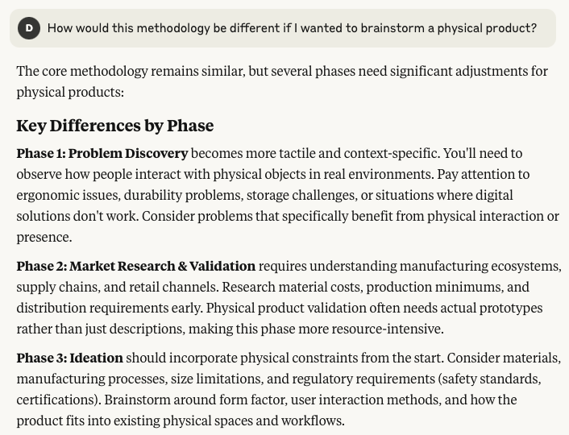

# Week 1B

## I. Hey, it's week 2!
- Welcome back!
- Anyone here today that wasn't here last week?
- Questions?

---

## II. Week 2 Study Guide - *Finding & Evaluating Information*

- [Week 2 Study Guide - Finding & Evaluating Information](https://docs.google.com/document/d/1wDECfUJ0vOIfQwDLwyfGh6lNDSAkpz16XXAOAUGdJ1A)
- Let's head to the applicable `#general` Slack thread about Gen AI and discuss

---

## III. Project 1 - App Proposal (team)

- We are going to assign your **Project 1 - App Proposal** teams soon

### Overview
- For project 1 you will work in a small group and create a written proposal for an “app”. For the purposes of the assignment, this app could be a phone or desktop app, a web site or even a physical product

### Some examples from last year
- *Bike Spikes* - a physical traction control solution for bicycles on winter roads
- *BetWise* - an app to help gambling addicts
- *UniAid* - a web portal that aggregates student support resources
- *Food Avenue* - a recipe finding app
- *VR Haptic Feedback Suit* - a physical product
- *Excuse Genie* - an app for generating excuses
- *Taser Bed* - a physical product that provides healthy electrical shocks, helps with oversleeping
- *Anime Soap* Lootboxes - collectible physical soap figures
- *NetPet* - a robotic companion physical product

---

## IV. Collaborating with Google Docs
- You will be using Google Docs to create a shared document that all of your Project 1 team members can contribute to 
- Be sure to login to Google Docs through your RIT account:
  - https://www.rit.edu/google/
- Let's quickly review the basics of using Google drive to create documents, assign access levels, and so on:
  - [How to use Google Drive](https://support.google.com/drive/answer/2424384)

---

## V. Brainstorming
- Next week you'll be brainstorming app ideas in your group, but today you'll do so on your own using AI tools

### General Approach

- Here's what [Claude.ai](https://claude.ai) thought about the process of brainstorming an app or service:

- and what it thought about brainstorming a physical product:

### Other considerations
- Note: Phase #1 and phase #3 above, are what we are concerned with today
- In the software app world there is the idea of an application definition statement - sort of an app "high concept" to boil the idea down to its essentials - which is *"What's it do? Who's it for?"*
- also, a product that is focused and does one thing really well (that solves a customer need) is better than a product that has a lot of features- the analogy is *"build scalpels, not Swiss Army knives"*

### Problem "discovered" --> Social Media *Doomscrolling*

- https://en.wikipedia.org/wiki/Doomscrolling
- https://www.gurwinder.blog/p/how-social-media-shortens-your-life

### A possible app (or service or product) related to Doomscrolling
- *Who is app for?*
- *What does app do?*
  - meaning, how could it help? Educate the user about the problem, mitigate the problem, offer alternative activities to the user?

### Let's brainstorm some app ideas for this specific problem using [Claude.ai](https://claude.ai/)

----

## VI. Generative AI tools for brainstorming
- Gen AI Tools
  - https://www.rit.edu/its/generative-ai
  - [ChatGPT](https://chatgpt.com/)
  - [Claude](https://claude.ai/)
  - [Meta AI](https://meta.ai/)
  - [Perplexity](https://perplexity.ai/)
  - Also: https://infoguides.rit.edu/aitools/list

---

## VII. In-class Exercise: Better brainstorming with https://gemini.google.com

- [AI Brainstorming Exercise with Gemini - Doomscrolling](../exercises/ai-brainstorming-2155.md)
  - see myCourses for due date!

---
---

| <-- Previous Unit | Home | Next Unit -->
| --- | --- | --- 
|   [**Week 1A Notes**](1A.md)  |  [**IGME-110 Home**](../) | [**Week 2A Notes**](2A.md)
